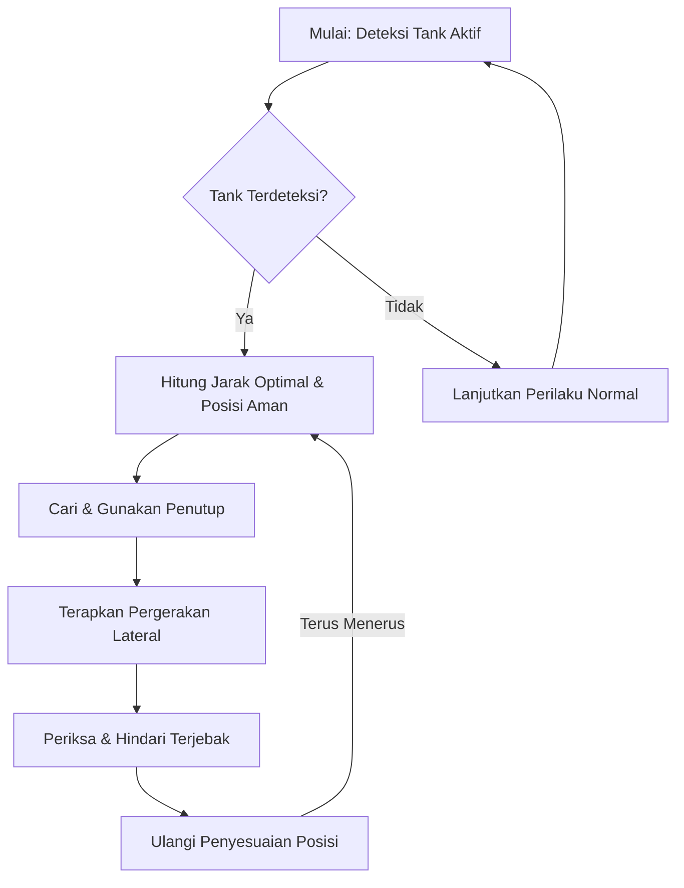

# Rencana Pengembangan: Posisi Bertahan Adaptif untuk Bots Survivor

Dokumen ini merinci langkah-langkah pengembangan fitur "Posisi Bertahan Adaptif" untuk bots survivor dalam menghadapi Tank, dengan fokus pada implementasi yang bertahap dan terperinci hanya pada file `left4bots_afterload.nut`.

## Konsep Fitur: Posisi Bertahan Adaptif

Bots akan secara cerdas menyesuaikan posisi mereka di medan perang untuk menjaga jarak aman dari Tank sambil tetap mempertahankan garis tembak yang jelas. Ini melibatkan pergerakan lateral, penggunaan penutup, dan menghindari terjebak di sudut.

### Detail Konsep:

*   **Jarak Optimal:** Bot akan berusaha menjaga jarak optimal dari Tank. Terlalu dekat berisiko terkena pukulan atau lemparan batu, terlalu jauh mengurangi akurasi dan *damage*. Jarak ini bisa bervariasi tergantung jenis senjata yang digunakan bot (misalnya, shotgun butuh jarak lebih dekat, sniper butuh jarak lebih jauh).
*   **Penggunaan Penutup:** Bot akan secara otomatis mencari dan menggunakan penutup (misalnya, dinding, mobil, objek besar) untuk melindungi diri dari serangan Tank, terutama lemparan batu yang mematikan. Prioritas penutup akan diberikan pada objek yang dapat sepenuhnya menghalangi pandangan Tank.
*   **Pergerakan Lateral:** Bots akan bergerak secara lateral (menyamping) secara konstan atau saat Tank menyerang untuk menghindari serangan langsung dan membuat Tank lebih sulit untuk memprediksi pergerakan mereka. Ini akan diintegrasikan dengan sistem navigasi bot yang ada.
*   **Hindari Terjebak:** AI bot akan memiliki logika untuk menghindari terjebak di sudut atau area sempit di mana mereka rentan terhadap serangan Tank. Mereka akan secara proaktif mencari jalur pelarian atau posisi yang lebih terbuka jika terdeteksi berada di area berisiko tinggi.

## Prioritas Pengembangan

1.  **Deteksi Tank:** Mengidentifikasi keberadaan Tank dan posisinya secara real-time.
2.  **Jarak Optimal:** Menghitung dan menjaga jarak optimal dari Tank berdasarkan jenis senjata bot dan kondisi medan perang.
3.  **Penggunaan Penutup:** Mencari dan memanfaatkan objek sebagai penutup dari serangan Tank.
4.  **Pergerakan Lateral:** Menerapkan pergerakan menyamping yang dinamis untuk menghindari serangan langsung.
5.  **Hindari Terjebak:** Mengembangkan logika untuk menghindari terjebak di area sempit dan mencari jalur evakuasi.

## Diagram Alur Kerja Umum

## Daftar Tugas (To-Do List)

### Pengingat untuk AI Agent:

Implementasikan konsep "Posisi Bertahan Adaptif" ke dalam file `left4bots_afterload.nut`. Fokus pada penambahan logika untuk:
*   Mendeteksi Tank dan posisinya.
*   Menghitung dan mempertahankan jarak optimal.
*   Mencari dan menggunakan penutup.
*   Melakukan pergerakan lateral.
*   Menghindari terjebak di area sempit.

---

### Detail Langkah-Langkah Implementasi di `left4bots_afterload.nut`:

#### 1. Deteksi Tank

*   **1.1. Inisialisasi Sistem Deteksi Tank:**
    *   Tambahkan variabel global atau properti pada objek bot untuk menyimpan referensi ke Tank yang terdeteksi (`g_hTankTarget`). Ini dapat diinisialisasi dalam fungsi `Left4Bots.AddBotThink` yang sudah ada.
    *   Pastikan variabel ini diatur ulang saat Tank tidak lagi menjadi ancaman atau mati.
*   **1.2. Fungsi Pendeteksi Tank Aktif:**
    *   Buat fungsi `L4B_IsTankActive()` yang secara periodik memeriksa keberadaan Tank di peta. Fungsi ini akan dipanggil dalam `Left4Bots.AIFuncs.BotThink_Main`.
    *   Gunakan fungsi game API yang relevan seperti `Entities.FindByClassname` atau `Entities.FindByClassnameWithin` dengan classname "tank" atau "charger" (jika Tank adalah Charger) untuk mengidentifikasi entitas Tank.
    *   Perbarui `g_hTankTarget` jika Tank terdeteksi atau set ke `null` jika tidak ada.
*   **1.3. Pembaruan Posisi Tank:**
    *   Dalam loop AI bot utama (`Left4Bots.AIFuncs.BotThink_Main`), dapatkan posisi (`GetAbsOrigin`) dan kecepatan (`GetAbsVelocity`) Tank yang terdeteksi menggunakan `g_hTankTarget`.
    *   Simpan posisi Tank terakhir untuk perhitungan pergerakan dan prediksi.

#### 2. Jarak Optimal

*   **2.1. Definisi Jarak Optimal Berdasarkan Senjata:**
    *   Buat tabel atau fungsi `L4B_GetOptimalDistance(hBot, hWeapon)` yang mengembalikan jarak optimal berdasarkan jenis senjata yang sedang dipegang bot. Gunakan `Left4Utils.GetWeaponTypeById(Left4Utils.GetWeaponId(hWeapon))` untuk mendapatkan jenis senjata.
    *   Definisikan rentang jarak aman (min dan max) untuk setiap jenis senjata (misalnya, shotgun: 200-500 unit, sniper: 800-1500 unit).
*   **2.2. Fungsi Perhitungan Jarak Saat Ini:**
    *   Gunakan `(bot.GetOrigin() - hTank.GetOrigin()).Length()` untuk menghitung jarak Euclidean antara bot dan Tank.
*   **2.3. Logika Penyesuaian Jarak:**
    *   Dalam `Left4Bots.AIFuncs.BotThink_Main`, bandingkan jarak saat ini dengan jarak optimal.
    *   Jika terlalu dekat, instruksikan bot untuk mundur. Ini dapat dilakukan dengan menghitung posisi mundur yang aman dan menggunakan `Left4Utils.BotCmdMove(self, target_position)`.
    *   Jika terlalu jauh, instruksikan bot untuk maju atau mencari posisi menembak yang lebih baik menggunakan `Left4Utils.BotCmdMove(self, target_position)`.
    *   Prioritaskan menjaga jarak optimal sambil tetap mempertahankan garis tembak yang jelas (memerlukan raycasting sederhana untuk memeriksa garis pandang).

#### 3. Penggunaan Penutup

*   **3.1. Identifikasi Objek Penutup Potensial:**
    *   Kembangkan fungsi `L4B_FindCover(hBot, hTank)` yang mencari objek di sekitar bot yang dapat berfungsi sebagai penutup.
    *   Gunakan raycasting (misalnya, `TraceLine` jika tersedia di Squirrel atau simulasi dengan `NavMesh` `IsBlocked` atau `IsVisible`) untuk memeriksa apakah objek dapat memblokir garis pandang dari Tank ke bot.
    *   Pertimbangkan properti objek (misalnya, `IsBreakable`, `IsSolid`) untuk menentukan efektivitas penutup.
*   **3.2. Fungsi Penilaian Penutup:**
    *   Berikan skor pada setiap objek penutup potensial berdasarkan faktor-faktor seperti: seberapa baik objek memblokir serangan Tank, jarak ke penutup, dan apakah penutup memungkinkan bot untuk tetap menembak Tank.
*   **3.3. Logika Bergerak ke Penutup:**
    *   Jika bot terdeteksi dalam bahaya (misalnya, Tank akan melempar batu, atau bot berada di area terbuka), instruksikan bot untuk bergerak ke penutup terbaik yang ditemukan menggunakan `Left4Utils.BotCmdMove(self, cover_position)`.
    *   Pastikan bot tidak terjebak saat bergerak ke penutup dengan memeriksa `NavMesh` konektivitas.

#### 4. Pergerakan Lateral

*   **4.1. Pemicu Pergerakan Lateral:**
    *   Aktifkan pergerakan lateral secara periodik saat Tank aktif dan bot berada dalam jarak serang.
    *   Picu pergerakan lateral saat Tank melakukan serangan langsung (misalnya, pukulan, lemparan batu) atau saat bot berada di garis tembak langsung Tank.
*   **4.2. Implementasi Gerakan Menyamping:**
    *   Buat fungsi `L4B_PerformLateralMovement(hBot, hTank)` yang menginstruksikan bot untuk bergerak ke kiri atau kanan secara acak atau berdasarkan posisi Tank.
    *   Hitung vektor lateral relatif terhadap arah pandang bot atau arah Tank, lalu gunakan `Left4Utils.BotCmdMove(self, lateral_target_position)`.
    *   Pastikan gerakan lateral tidak membuat bot menabrak rintangan atau terjebak dengan memeriksa `NavMesh` atau melakukan raycasting.
*   **4.3. Integrasi dengan AI Navigasi:**
    *   Pastikan pergerakan lateral tidak mengganggu jalur navigasi utama bot (`currentPath` yang digunakan oleh `Dynamic Pathfinding`). Prioritaskan menghindari serangan Tank saat melakukan pergerakan lateral.

#### 5. Hindari Terjebak

*   **5.1. Deteksi Area Terjebak/Sempit:**
    *   Kembangkan fungsi `L4B_IsBotTrapped(hBot)` yang memeriksa apakah bot berada di area sempit atau buntu. Ini dapat melengkapi atau memperluas fungsi `BotStuckMonitor` yang sudah ada.
    *   Gunakan informasi `NavMesh` (misalnya, `NavMesh.GetNearestNavArea` dan memeriksa koneksi area) atau raycasting untuk mendeteksi rintangan di sekitar bot.
    *   Definisikan ambang batas "sempit" berdasarkan lebar bot dan lingkungan.
*   **5.2. Logika Pencarian Jalur Pelarian:**
    *   Jika `L4B_IsBotTrapped` mengembalikan true, picu pencarian jalur pelarian.
    *   Gunakan fungsi `FindPath(startNav, endNav)` yang sudah ada di `left4bots_afterload.nut` untuk mencari node navigasi yang lebih terbuka atau jalur keluar dari area sempit. `startNav` akan menjadi `NavMesh.GetNearestNavArea(bot.GetOrigin())`.
    *   Prioritaskan jalur yang menjauh dari Tank.
*   **5.3. Prioritas Jalur Pelarian:**
    *   Jika ada beberapa jalur pelarian, pilih yang paling aman atau paling cepat.
    *   Instruksikan bot untuk bergerak sepanjang jalur pelarian menggunakan `Left4Utils.BotCmdMove(self, next_node_position)`.
    *   Pastikan logika ini terintegrasi dengan perilaku AI lainnya agar bot tidak terus-menerus mencoba bergerak ke area yang sama.

---

**Catatan Tambahan:**

*   Semua logika ini harus diintegrasikan dengan hati-hati ke dalam loop `OnThink` atau fungsi AI utama bot di `left4bots_afterload.nut` (yaitu, `Left4Bots.AIFuncs.BotThink_Main`) untuk memastikan eksekusi yang efisien dan responsif.
*   Pertimbangkan penggunaan timer atau cooldown untuk menghindari spamming pergerakan atau perhitungan yang berlebihan.
*   Gunakan debug overlay atau print console untuk memvisualisasikan perilaku bot selama pengembangan.
*   Fungsi-fungsi seperti `Left4Utils.BotCmdMove`, `GetAbsOrigin`, `GetAbsVelocity`, `Left4Utils.GetWeaponTypeById`, `Left4Utils.GetWeaponId`, `NavMesh.GetNearestNavArea`, `FindPath`, dan `AngleToForwardVector` sudah ada atau dapat dengan mudah diimplementasikan berdasarkan struktur kode yang ada.
