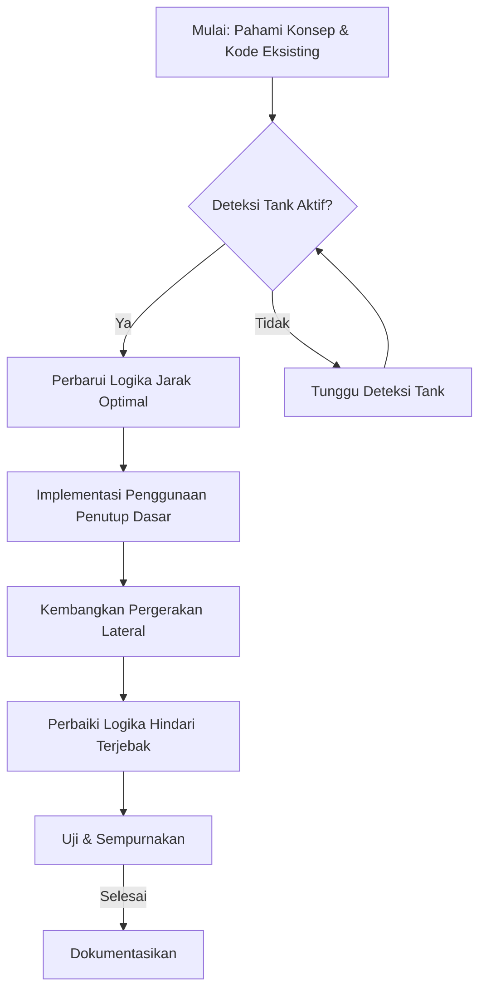

# Rencana Pengembangan: Posisi Bertahan Adaptif untuk Bots Survivor

Dokumen ini merinci langkah-langkah pengembangan fitur "Posisi Bertahan Adaptif" untuk bots survivor dalam menghadapi Tank, dengan fokus pada implementasi yang bertahap dan terperinci.

## Konsep Fitur

Bots akan secara cerdas menyesuaikan posisi mereka di medan perang untuk menjaga jarak aman dari Tank sambil tetap mempertahankan garis tembak yang jelas. Ini melibatkan pergerakan lateral, penggunaan penutup, dan menghindari terjebak di sudut.

## Prioritas Pengembangan

1.  **Jarak Optimal:** Bot akan berusaha menjaga jarak optimal dari Tank.
2.  **Pergerakan Lateral:** Bots akan bergerak secara lateral (menyamping) untuk menghindari serangan langsung Tank.
3.  **Penggunaan Penutup:** Bot akan secara otomatis mencari dan menggunakan penutup terdekat yang terlihat.
4.  **Hindari Terjebak:** AI bot akan memiliki logika untuk menghindari terjebak di sudut atau area sempit.

## Diagram Alur Kerja Umum

## Daftar Tugas (To-Do List)
